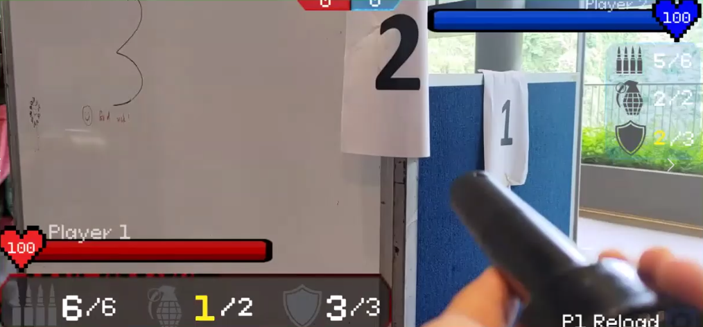
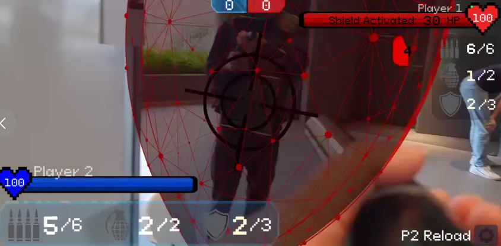
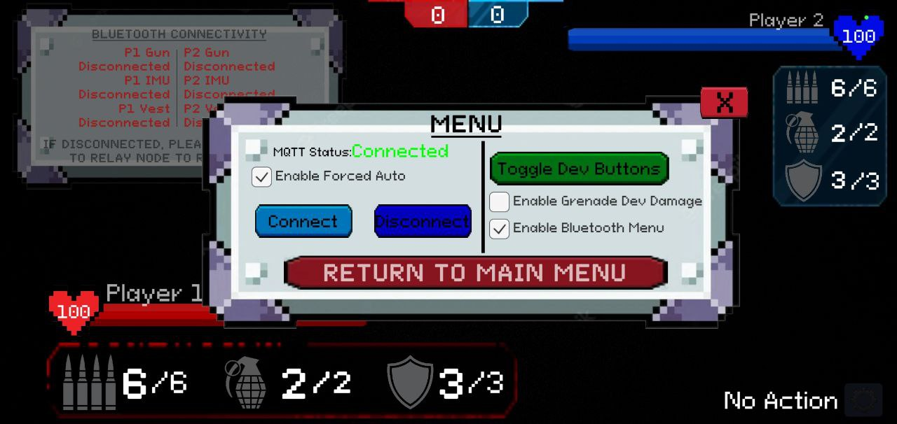

<h1 align="center">📄 CG4002 - Computer Engineering Capstone 📄</h1>

Scripts written for animations, health/score/ammo tracking and MQTT connectivity can be found at */Assets/Scripts/*.

## Assets Used
- Vuforia Engine for QR Code Target tracking
- M2MQTT for Unity
- Explosions Pack
- Force Shield Pack
- Grenade Pack
- Respective icons and sprites

## Screenshots
### :flashlight: Player 1

*Screenshot is cropped since it was taken from our live demo recording, but I promise it runs full screen!

### ✨ Player 2

### ☀️ Player Settings

