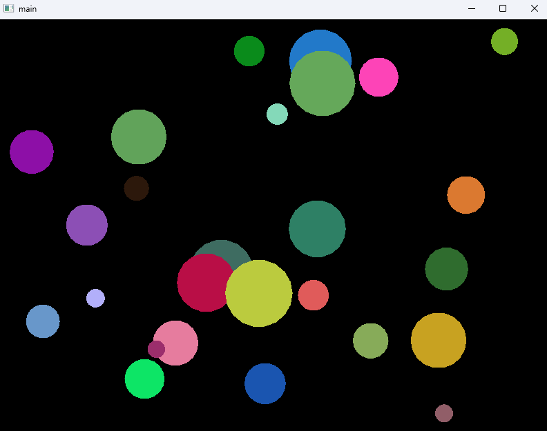
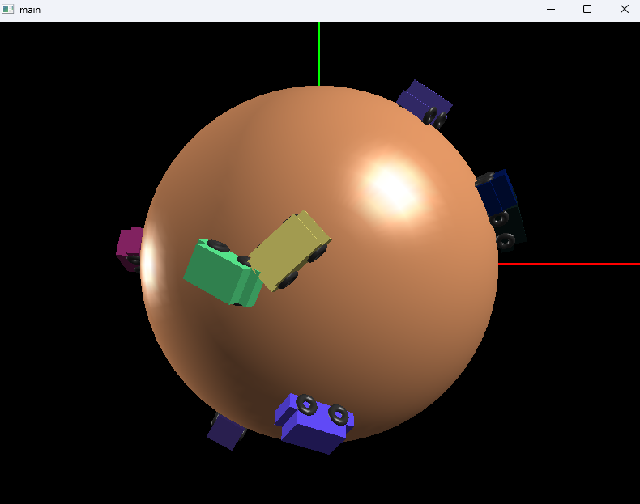
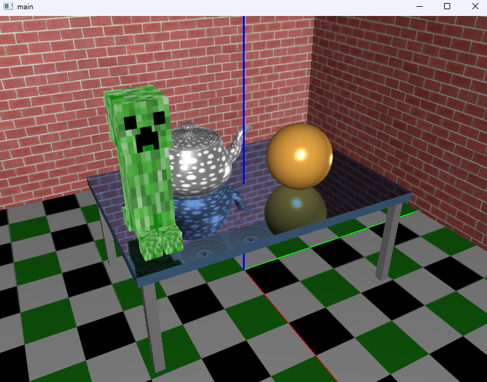
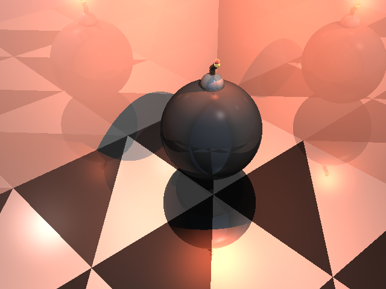

<h1 align="center">📄 CS3241 - Computer Graphics 📄</h1>

### 🚀 Lab 1 - Bouncing Balls

#### Lab 1 Learning Objectives:
- The basic structure of an OpenGL program, 
- How to use some basic OpenGL functions, 
- How to use the GLUT (FreeGLUT) callback to get user input and enable interaction, 
- How to use double-buffering to make animations look smoother, and
- How to use the GLUT (FreeGLUT) timer callback to control the speed of animation.

### :flashlight: Lab 2 - Moving Cars

#### Lab 2 Learning Objectives:
- How to set up the view transformation (camera position and orientation) in OpenGL, 
- How to set up perspective viewing in OpenGL, 
- How to use the OpenGL transformations for modeling, and
- How to use the OpenGL transformations for animation.

### ✨ Lab 3 - Simulating Planar Reflection

#### Lab 3 Learning Objectives:
- How to set up texture mapping in OpenGL,
- How to model and draw texture-mapped objects,
- How to set up off-center view frustum,
- How to read back image in framebuffer for texture mapping, and
- How to simulate planar reflection using a multi-pass rendering technique.

### ☀️ Lab 4 - Ray Tracing

#### Lab 4 Learning Objectives:
- How to compute ray intersection with some simple implicit-form surface primitive,
- How to do lighting computation,
- How to shoot shadow rays to generate shadows,
- How to spawn secondary rays,
- How to trace rays recursively, and
- How the Whitted Ray Tracing algorithm works.